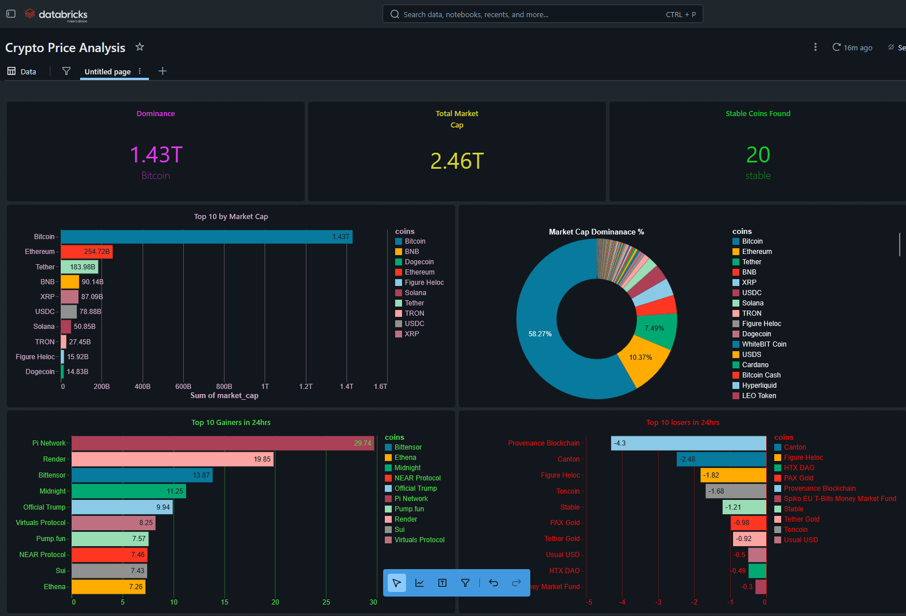
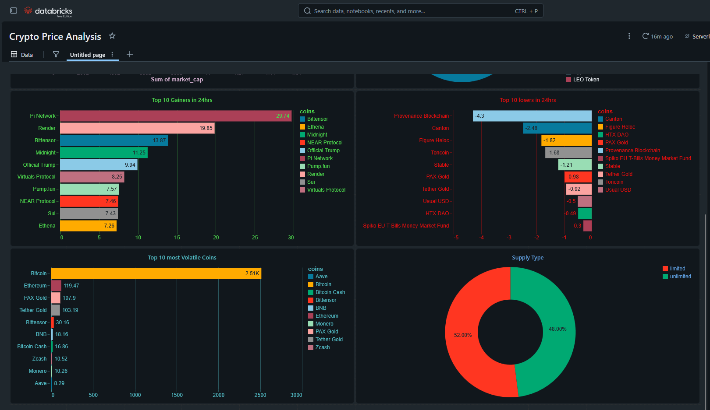
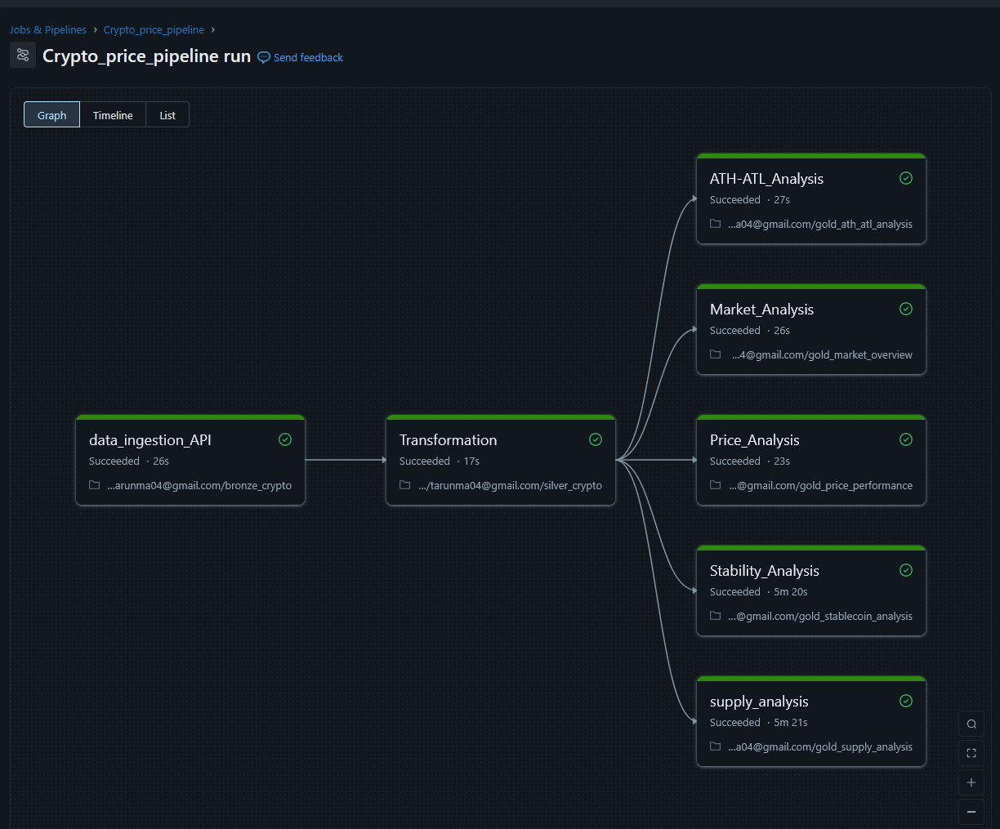
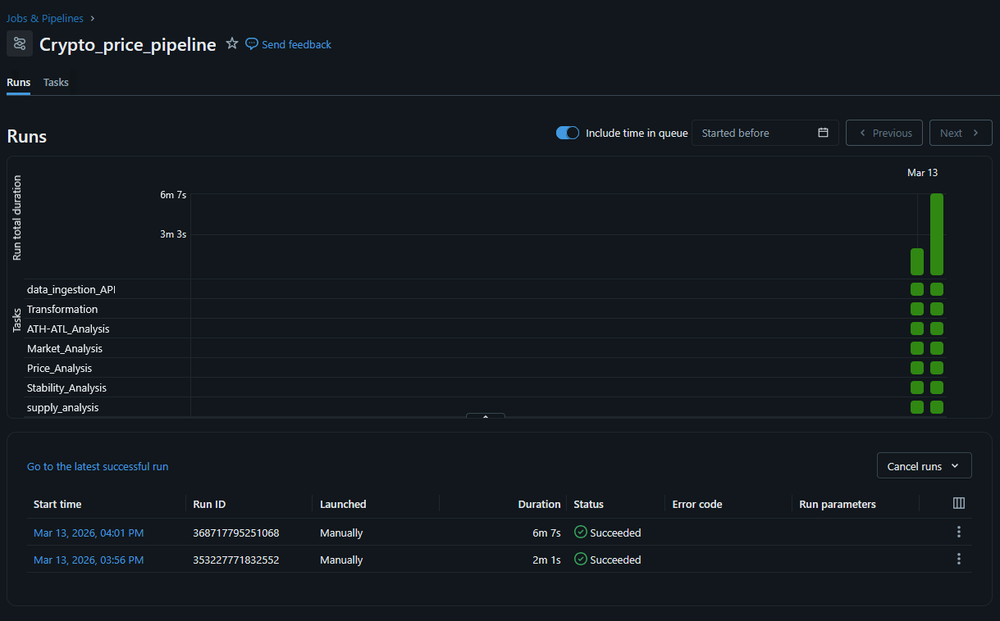

# 📈 Crypto Price Analytics Pipeline


An end-to-end crypto price analytics pipeline built on **Databricks Community Edition** using the **Medallion Architecture** (Bronze → Silver → Gold), fetching live data from the CoinGecko API, transforming with PySpark & Delta Lake, orchestrated via a 7-task Databricks Jobs pipeline with 13 Gold tables and an interactive SQL Dashboard.

---

## 📐 Architecture

```
CoinGecko API (Top 100 Coins)
        ↓
[Bronze Layer]  →  Raw API data ingestion → Delta Table
        ↓
[Silver Layer]  →  Cleaning & Transformation → Delta Table
        ↓
[Gold Layer]    →  13 Analytics Tables (5 notebooks)
        ↓
[Dashboard]     →  10 Visualizations in Databricks SQL
```

---

## 🗂️ Project Structure

```
crypto-price-pipeline/
├── notebooks/
│   ├── 01_bronze_layer.ipynb               ← API ingestion
│   ├── 02_silver_layer.ipynb               ← Cleaning & transformation
│   ├── 03_gold_market_overview.ipynb       ← Market cap, volume, dominance
│   ├── 04_gold_price_performance.ipynb     ← Gainers, losers, volatility
│   ├── 05_gold_ath_atl_analysis.ipynb      ← ATH/ATL analysis
│   ├── 06_gold_supply_analysis.ipynb       ← Supply analysis
│   └── 07_gold_stablecoin_analysis.ipynb   ← Stablecoin analysis
├── screenshots/
│   ├── dashboard_1.png                     ← Databricks SQL Dashboard (part 1)
│   ├── dashboard_2.png                     ← Databricks SQL Dashboard (part 2)
│   ├── pipeline_tasks.png                  ← Databricks Jobs task flow
│   └── pipeline_runs.png                   ← Successful pipeline runs
└── README.md
```

---

## 📡 Data Source

- **API:** [CoinGecko API](https://www.coingecko.com/en/api) (free, no API key required)
- **Endpoint:** `/coins/markets` — Top 100 coins by market cap
- **Currency:** USD
- **Records:** 100 coins, 26 columns
- **Key Fields:** name, current_price, market_cap, total_volume, price_change_percentage_24h, ath, atl, circulating_supply, max_supply

---

## 🛠️ Tech Stack

| Tool | Purpose |
|------|---------|
| Databricks Community Edition | Cloud compute & notebooks |
| CoinGecko API | Live crypto data source |
| PySpark | Data transformation |
| Delta Lake | Storage layer (ACID transactions) |
| Databricks SQL | Dashboard & visualization |
| Databricks Jobs | Pipeline orchestration (7 tasks) |
| Python / Pandas | API ingestion & bridging |

---

## 🔄 Pipeline Layers

### 🥉 Bronze Layer — Raw API Ingestion
- Fetched top 100 coins from CoinGecko API using `requests`
- Used Pandas as a bridge to create Spark DataFrame (serverless compatible)
- Saved as Delta table: `crypto_schema.bronze_crypto`

### 🥈 Silver Layer — Cleaning & Transformation
- Dropped `roi` column (89% null, nested struct) and `image` (URL, no analytical value)
- Converted timestamps: `last_updated`, `ath_date`, `atl_date` using `.cast('timestamp')`
- Replaced `max_supply` nulls with 0 (48 coins = unlimited supply like Ethereum)
- Saved as Delta table: `crypto_schema.silver_crypto`

### 🥇 Gold Layer — 13 Analytics Tables

#### 📊 Market Overview (03_gold_market_overview)
| Table | Description |
|-------|-------------|
| `gold_top_market_cap` | Top 10 coins by market cap |
| `gold_top_volume` | Top 10 coins by trading volume |
| `gold_market_cap_dominance` | Market cap dominance % for all 100 coins |

#### 📈 Price Performance (04_gold_price_performance)
| Table | Description |
|-------|-------------|
| `gold_top_gainers` | Top 10 coins by 24h price gain |
| `gold_top_losers` | Top 10 coins by 24h price loss |
| `gold_volatility` | Top 10 most volatile coins (high_24h - low_24h) |

#### 🏆 ATH/ATL Analysis (05_gold_ath_atl_analysis)
| Table | Description |
|-------|-------------|
| `gold_closest_to_ath` | Coins nearest their all-time high |
| `gold_furthest_from_ath` | Coins furthest from their all-time high |
| `gold_recent_ath` | Coins that hit ATH most recently |
| `gold_biggest_atl_gain` | Coins with biggest gain from all-time low |

#### 🪙 Supply Analysis (06_gold_supply_analysis)
| Table | Description |
|-------|-------------|
| `gold_supply_type` | Limited vs unlimited supply coin count |
| `gold_circulating_supply_pct` | Circulating supply as % of max supply |

#### 💵 Stablecoin Analysis (07_gold_stablecoin_analysis)
| Table | Description |
|-------|-------------|
| `gold_stablecoin_analysis` | All stablecoins (price between $0.95–$1.05) |

---

## 📊 Dashboard




### 10 Visualizations:
- **Row 1** — 3 Metric Cards: Total Market Cap, Bitcoin Dominance %, Stablecoin Count
- **Row 2** — Top 10 Market Cap (bar) + Market Dominance (pie)
- **Row 3** — Top Gainers (bar) + Top Losers (bar)
- **Row 4** — Volatility (bar) + Supply Type (pie)
- **Row 5** — Stablecoin Analysis (table)

### Key Insights:
- 🟠 **Bitcoin** dominates with **58.25%** of total market cap
- 💵 **Tether** is the #1 coin by trading volume — more than Bitcoin!
- 📉 **Internet Computer & Filecoin** are furthest from ATH at **-99.62%**
- 🐕 **Shiba Inu** gained **10,532,818%** from its all-time low
- 🏦 **20 stablecoins** found out of 100 coins (20% of market!)
- ₿ **Bitcoin** has already mined **95.25%** of its 21M total supply

---

## ⚙️ Pipeline Orchestration

### Task Flow:


Built a **Databricks Job** with 7 dependent tasks:

```
Bronze → Silver → Gold_Market
                → Gold_Price
                → Gold_ATH_ATL
                → Gold_Supply
                → Gold_Stablecoin
```
Gold tasks (3–7) run **in parallel** after Silver completes!

### Successful Runs:


- ✅ Automated success & failure **email notifications**
- ✅ 5 Gold notebooks run in parallel after Silver
- ✅ Tasks run with dependency enforcement

---

## 🚀 How to Run

1. Clone this repository
2. Upload notebooks to **Databricks Community Edition**
3. Run notebooks in order:
   - `01_bronze_layer.ipynb`
   - `02_silver_layer.ipynb`
   - `03_gold_market_overview.ipynb`
   - `04_gold_price_performance.ipynb`
   - `05_gold_ath_atl_analysis.ipynb`
   - `06_gold_supply_analysis.ipynb`
   - `07_gold_stablecoin_analysis.ipynb`
4. Create Databricks SQL Dashboard using Gold tables

---

## 📈 Data Quality Summary

| Layer | Records | Notes |
|-------|---------|-------|
| Bronze | 100 coins, 26 columns | Raw API data |
| Silver | 100 coins, 24 columns | Dropped roi & image columns, fixed timestamps |
| Gold | 13 tables | Aggregated analytics ready for dashboard |

---

## 👤 Author

**MinatoNamikaze25**
- GitHub: [@MinatoNamikaze25](https://github.com/MinatoNamikaze25)
